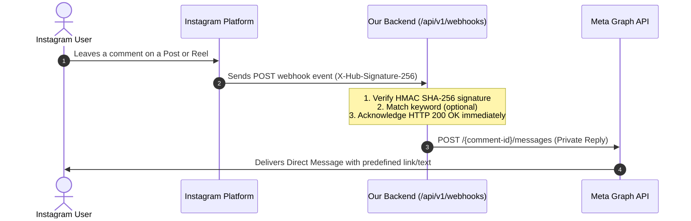

# Instagram + Facebook Auto-DM System (Testing & Scaffolding)

A clean, modular Python & FastAPI backend designed to automate direct message (DM) replies when users comment on your Instagram posts or reels, adhering strictly to **Meta's official Graph API specifications and developer policies**.

---

## 🎯 How the Automation System Works

When fully connected in Phase 2, the end-to-end automation operates via Meta's official Webhook and Messenger Send APIs:



### 📋 Meta Official Policies & Rules for Private Replies
1. **7-Day Window**: Automated private replies can only be sent within **7 days** of the comment being posted.
2. **One Reply Per Comment**: Meta strictly allows only **one automated private reply** per unique comment.
3. **24-Hour Messaging Window**: Once the private reply is sent, subsequent messages can only be sent if the user actively replies in the DM, opening standard 24-hour customer care messaging.
4. **No Spam / Policy Compliance**: Content must provide genuine value requested by the user (e.g., "Comment 'LINK' to get the recipe") and not spam unsolicited advertisements.

---

## 📁 Project Structure & File Guide

```
c:/insta-auto-dm/
├── .env.example               # Template documenting all required environment variables and secrets
├── .gitignore                 # Enforces that .env, virtual environments, and caches are never committed
├── requirements.txt           # Project dependencies (FastAPI, Uvicorn, Pydantic, HTTPX, Pytest)
├── README.md                  # Complete architectural documentation and setup instructions
├── app/
│   ├── __init__.py            # Package declaration and version metadata
│   ├── main.py                # Application factory, lifespan management, CORS, and root /health
│   ├── core/
│   │   ├── __init__.py        # Core package exports
│   │   ├── config.py          # Centralized, type-safe settings loaded via pydantic-settings
│   │   └── security.py        # Meta X-Hub-Signature-256 cryptographic verification utility
│   ├── schemas/
│   │   ├── __init__.py        # Schema exports
│   │   ├── health.py          # Pydantic model for health check status responses
│   │   └── webhook.py         # Pydantic models for incoming Meta webhook events
│   ├── services/
│   │   ├── __init__.py        # Service exports
│   │   └── meta_service.py    # Service interface and contract for Meta Graph API interactions
│   └── api/
│       ├── __init__.py        # API package exports
│       └── v1/
│           ├── __init__.py    # v1 package exports
│           ├── api.py         # Combines health and webhook routers under /api/v1
│           └── endpoints/
│               ├── __init__.py
│               ├── health.py  # Diagnostic /health endpoint router
│               └── webhooks.py# Meta Webhook verification handshake and event receiver
└── tests/
    ├── __init__.py            # Test package declaration
    └── test_health.py         # Automated unit test suite verifying health endpoints
```

### What Each File Does
- **`app/main.py`**: Initializes the FastAPI app, configures CORS middleware, registers lifecycle events, provides the top-level `/health` route, and mounts `/api/v1` routes.
- **`app/core/config.py`**: Reads `.env` and environment variables into a cached `Settings` object using `pydantic-settings`. Keeps secrets out of source code.
- **`app/core/security.py`**: Contains `verify_meta_signature()`, which uses HMAC SHA-256 and constant-time string comparison (`hmac.compare_digest`) to verify that webhook calls originate from Meta.
- **`app/schemas/health.py`**: Defines the response structure for `/health` (`status`, `service`, `environment`, `version`, `timestamp`).
- **`app/schemas/webhook.py`**: Provides typed models for Meta webhook payloads (Entries, Changes, Values, Comments, Senders, Media).
- **`app/services/meta_service.py`**: Outlines the `MetaApiService` class responsible for sending private replies. Safely checks if credentials exist and raises clean exceptions instead of simulating fake API calls.
- **`app/api/v1/endpoints/health.py`**: Implements the modular `/api/v1/health` endpoint.
- **`app/api/v1/endpoints/webhooks.py`**: Implements `GET /api/v1/webhooks` (Meta subscription verification handshake) and `POST /api/v1/webhooks` (event ingestion).
- **`tests/test_health.py`**: Pytest test suite testing `/health`, `/api/v1/health`, and the root index `/`.

---

## 🚀 Getting Started

### 1. Prerequisites
- Python 3.10+ installed on your system.

### 2. Set Up Virtual Environment

Open PowerShell in the project directory:

```powershell
# Create a virtual environment
python -m venv venv

# Activate the virtual environment
.\venv\Scripts\Activate.ps1
```

### 3. Install Dependencies

```powershell
pip install -r requirements.txt
```

### 4. Configure Environment Variables

Copy `.env.example` to create your local `.env`:

```powershell
copy .env.example .env
```

*(For Phase 1 testing, the default settings in `.env.example` work out of the box for local server operation).*

### 5. Run the Application

Start the local development server:

```powershell
uvicorn app.main:app --reload --host 127.0.0.1 --port 8000
```

The server will be available at:
- **Interactive API Docs (Swagger UI)**: [http://127.0.0.1:8000/docs](http://127.0.0.1:8000/docs)
- **Health Check Endpoint**: [http://127.0.0.1:8000/health](http://127.0.0.1:8000/health)
- **Versioned Health Check**: [http://127.0.0.1:8000/api/v1/health](http://127.0.0.1:8000/api/v1/health)

### 6. Run Automated Tests

Run the test suite using pytest:

```powershell
pytest -v
```

---

## 🔒 Security Best Practices

1. **Zero Hardcoded Secrets**: All tokens, app secrets, and credentials reside in `.env`, which is ignored by `.gitignore`.
2. **Payload Verification**: Webhook callbacks should be signed by Meta and verified against `META_APP_SECRET` using `app.core.security.verify_meta_signature`.
3. **No Fake Credentials**: The codebase does not simulate fake tokens or pretend external API calls are successful. Unconfigured service calls fail fast with clear configuration guidance.

---

## ⏭️ Next Steps for Phase 2 (Real Meta Integration)

When you are ready to connect to real Meta services:

1. **Meta Developer Account & App Creation**:
   - Go to [developers.facebook.com](https://developers.facebook.com) and create a Meta App of type **Business**.
   - Add the **Instagram Graph API** and **Messenger** products to your app.
2. **Account Linking**:
   - Convert your Instagram account to a **Professional (Business or Creator)** account.
   - Link your Instagram Professional account to a **Facebook Page** that you manage.
3. **Required Permissions**:
   - In the Meta App Dashboard, request the following permissions:
     - `instagram_manage_comments`
     - `instagram_manage_messages`
     - `pages_manage_metadata`
     - `pages_read_engagement`
4. **Generate Page Access Token**:
   - Using the Meta Graph API Explorer or System User in Business Manager, generate a long-lived **Page Access Token**.
5. **Local Tunneling (for Webhooks)**:
   - Meta requires an HTTPS webhook URL. For local testing, use a tunneling tool such as [ngrok](https://ngrok.com/) or Cloudflare Tunnels:
     ```bash
     ngrok http 8000
     ```
   - Provide the ngrok HTTPS URL (`https://<id>.ngrok-free.app/api/v1/webhooks`) in Meta's Webhook dashboard along with your `META_VERIFY_TOKEN`.
